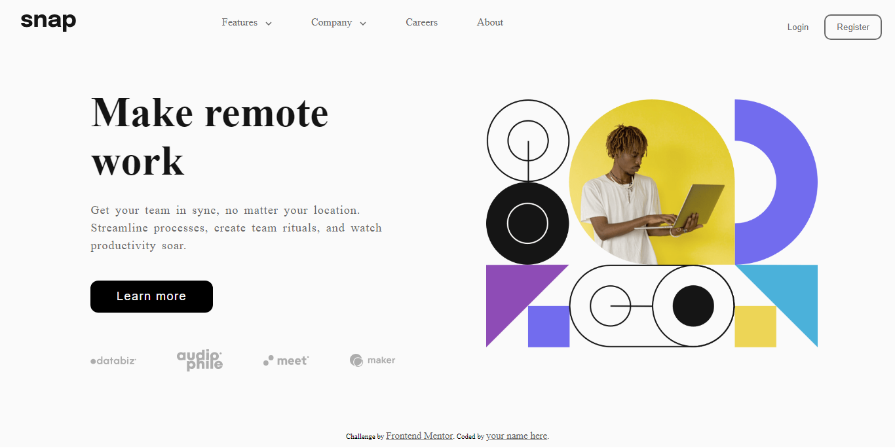

# Frontend Mentor - Intro section with dropdown navigation solution

This is a solution to the [Intro section with dropdown navigation challenge on Frontend Mentor](https://www.frontendmentor.io/challenges/intro-section-with-dropdown-navigation-ryaPetHE5). Frontend Mentor challenges help you improve your coding skills by building realistic projects. 

## Table of contents

- [Overview](#overview)
  - [The challenge](#the-challenge)
  - [Screenshot](#screenshot)
  - [Links](#links)
- [My process](#my-process)
  - [Built with](#built-with)
  - [What I learned](#what-i-learned)
- [Author](#author)

## Overview

### The challenge

Users should be able to:

- View the relevant dropdown menus on desktop and mobile when interacting with the navigation links
- View the optimal layout for the content depending on their device's screen size
- See hover states for all interactive elements on the page

### Desktop screenshot

### Links

- Solution URL: [intro-section-with-dropdown-navigation-main](https://github.com/Sarah-okolo/intro-section-with-dropdown-navigation-main)
- Live Site URL: [introsection-with-dropdown-navigation](https://introsection-with-dropdown-navigation.netlify.app/)

## My process

I created the mobile view first then moved on to create the tablet view, and then the desktop view.

### Built with

- Semantic HTML5 markup
- CSS custom properties
- Flexbox
- CSS Grid
- Mobile-first workflow

### What I learned
I learned how to create a beautiful custom dropdown menu when building this project

## Author

- Frontend Mentor - [@sarah-okolo](https://www.frontendmentor.io/profile/sarah-okolo)